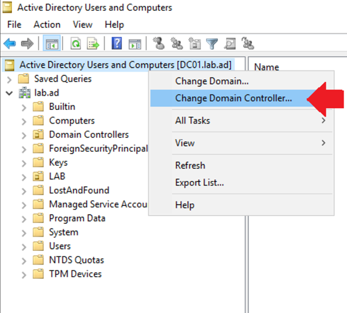
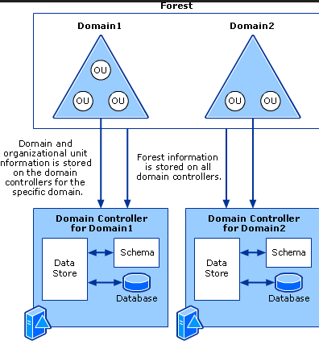

Active Directory — centralized management of users, computers, and other resources...

Directory Service

- Storage of information about users (login credentials, contact information such as emails, phone numbers, identification) as well as computers, or services that users can utilize.
- The directory service accesses the so-called **directory**, which is a database where information about objects that are part of the computer network (users, computers, printers, network storage, etc.) is stored within a hierarchical structure.
- Central authentication authority, enabling secure authentication (identity verification) of resources (users, services, computers).
- LDAP (Lightweight Directory Access Protocol) — specifies what information and how it is sent.

Active Directory Domain Services

- Implementation of directory service from Microsoft.
- The descriptive part contains **objects** such as users, groups, computers, accounts, and other resources. An object that can contain other objects is called a **container**, an often-used example of a container is an organizational unit (OU). An object that cannot contain other objects is called a **leaf**.
- Each object has some properties, for example, a user has a name, surname, email, organizational affiliation, or group membership. These properties are called **attributes**.

Hierarchy

- It is used for geographical division (branch in Prague and in Pardubice) or organizational (IT department, accounting department, management, etc.).
- Multiple objects form a **domain**.
- Each domain has separate settings (e.g., security rules or permissions). If there are multiple domains in the hierarchy, this structure is called a **tree**. Multiple trees then form a **forest**.
- The physical structure, connectivity, or topology of the organization is represented by so-called **sites**.
- **Domain controller** contains a part of the database where information about the domain is stored. It serves as a link between client devices and AD. Multiple controllers can be created for one domain.

Components and Key Concepts of AD

**Forest, OU, Domain**

- A forest is the highest level of the AD logical structure. It represents a specific directory. It serves as a security barrier/boundary — administrators of one forest control the accesses stored within the domains of that forest.
- Domain — represents finer division within the forest. It contains information about a portion of objects stored on a domain controller. Data relevant to the entire forest is replicated to all domain controllers in the forest.
- Organizational Unit (OU) allows finer division of objects within one domain and easier management of individual domain objects through GPO — group policy objects.

**Schema**

- Everything in AD is stored as an object. Schema represents the description of AD objects. There are 2 types of schemas — classSchema and attributeSchema.
- classSchema — class definition — class represents the type of object in AD, e.g., user, computer, OU.
- attributeSchema — definition of specific properties of individual objects (e.g., telephone, email, address, etc.)

**Distinguished Name**

Every object in AD has its unique name, called **distinguished name** (DN). This name also represents the position of the object in the hierarchical structure. There is also a relative distinguished name, which represents the last node in the given structure. Both names consist of so-called naming attributes, specified by pairs of "attribute_type=attribute_value". Attribute types are:

- CN (common name),
- OU (organizational unit),
- DC (domain component).

Let's see how DN and RDN could look in a specific example.

Let's have an AD domain called firma.cz. Within this domain, there is a user account for user Jan Novak, who works in the accounting department. The DN of the user could look like this:

DN: CN=jnovak, OU=ucto, OU=Users, DC=firma, DC=cz
RDN: CN=jnovak

**Domain Controller**

Every domain must contain a domain controller (DC), which must be a computer with Windows Server OS (from version 2003 to 2016). Depending on the age of the OS, the properties of the domain managed in this way differ. Each DC contains a replica of the corresponding directory, that is, the given (sub)structure of AD. If it is a tree, there is always a so-called **global catalog** (GC) that contains the directory of the entire tree. In addition to storing information, the domain controller also handles authentication and object management through policies.

**Network Authentication**

Authentication is the confirmation of a user's authenticity (that the user is indeed claiming a specific identity). A great advantage of ADDS is that user accounts can be centrally managed in one place, allowing users to use various network resources. The Kerberos protocol is used for network authentication of users within ADDS. More information on authentication mechanisms can be found at [link](https://learn.microsoft.com/en-us/windows-server/security/windows-authentication/windows-authentication-overview).

**Kerberos and KDC**

For computers to benefit from ADDS, they must be **joined to the domain (domain join).** Joining the domain essentially means that an account is created for the computer in AD, and this machine uses Kerberos for authentication when communicating with network services. Authentication via Kerberos is used not only for users but generally for verifying any accounts. The functionality of authentication is ensured by the **Kerberos Key Distribution Center (KDC).** The principle of authentication is based on so-called tickets, based on which the KDC grants access to the requested services. Tickets have limited validity, and it is necessary to renew them regularly. The KDC consists of two parts:

- **Authentication Server** - this part authenticates users and issues tickets.
- **Ticket Granting Server** - this part, based on valid tickets, allows access to network services.

The end object (e.g., computer) and the KDC share a secret key, through which they encrypt communication. The security of the service significantly depends on both entities (KDC and the target object) using the same time. More information about Kerberos and its implementation in ADDS can be found at [link](https://learn.microsoft.com/en-us/windows-server/security/kerberos/kerberos-authentication-overview).

**Key Concepts of ADDS**

A broader description of AD concepts can be found in MS Docs documentation:

[link](https://docs.microsoft.com/en-us/windows-server/identity/ad-ds/get-started/virtual-dc/active-directory-domain-services-overview)

The main advantages of Active Directory are primarily:

1. Centralized resource and security management — if all network objects are in Active Directory, they can be managed from one place.
2. Easy resource sharing — linking objects facilitates access to network resources (printers, network drives, or other systems and applications).
3. Unified authentication — within the entire domain, it is possible to work with only one identity, thus utilizing the Single Sign-On (SSO) principle.
4. Easier scalability — relatively easy addition of another object within the network with automatic linkage to other objects.

On the other hand, deploying Active Directory within an organization brings some challenges:

1. Cost of the solution.
2. Main focus of the platform on Windows OS (although there is limited support for macOS and Linux).
3. In case of a domain controller (DC) failure without a backup, it can cause dysfunctionality of the entire organization.

Deciding whether to deploy Active Directory and to what extent depends on many circumstances. The size of the company and thus the extent of the managed network is of course crucial. It probably doesn't make sense to deploy AD for an IT organization with only 5 computers, where each user manages their own computer. On the other hand, an organization with dozens of users, which is divided into several different departments or organizational levels, can benefit from the advantages of AD (e.g., departmental shared resources). The way resources are used also plays a role — for example, if there are few shared resources in the organization or none at all, deployment again makes no sense. However, if, for example, user migration between computers is necessary (e.g., in computer labs at school), AD can be a solution. Internal corporate policies (e.g., security restrictions) can also be important. With a large number of network resources, AD can help with easier management.

**User Management**
Active Directory Users and Computers Tool

**Joining a Computer to the Domain**
Settings->System->About->Related settings->Rename this PC (advanced)

**Installation of Active Directory Domain Services (AD DS) Role on Windows Server 2019:**

1. Log in to the Windows Server 2019 using an account with administrative privileges.
2. Open Server Manager by clicking on the "Server Manager" icon in the taskbar or by running "ServerManager.exe" from the Start menu.
3. In Server Manager, click on "Manage" in the top right corner and select "Add Roles and Features."
4. Follow the wizard to add roles and features, selecting "Active Directory Domain Services" when prompted for roles.
5. Proceed with the installation, confirming all default options. A server restart will be required upon completion of the installation.

**Promotion to Domain Controller and Selecting Forest:**

6. After the server restart, log in to the Windows Server 2019 using an account with administrative privileges.
7. Open Server Manager by clicking on the "Server Manager" icon in the taskbar or by running "ServerManager.exe" from the Start menu.
8. In Server Manager, click on "Manage" in the top right corner and select "Add Roles and Features."
9. Follow the wizard, and when prompted for deployment configuration, select "Add a new forest."
10. Enter the desired domain name, such as "web.inc" or "webinc.local," according to your requirements.
11. Complete the wizard and the installation process. A server restart will be required upon completion.

**Configuration of DHCP Server:**

12. After the server restart, configure the DHCP service.
13. Open Server Manager and click on "Tools" in the top menu.
14. Select "DHCP" from the tools menu.
15. In DHCP Manager, right-click on the server name and select "New Scope."
16. Follow the wizard to create a new DHCP scope, setting parameters such as IP address range, default gateway, DNS servers, and others as needed.
17. After configuring the new DHCP scope, wait for a few moments for automatic IP address assignment to clients. If clients do not receive IP addresses, troubleshoot network connectivity issues, including checking if ping is successful between client and server.
18. If necessary, restart the DHCP service or the entire server to ensure proper functioning.

**Joining a Desktop Operating System to the Domain:**

19. Log in to the Windows 10 desktop computer using an account with administrative privileges.
20. Open "Control Panel" and click on "System and Security."
21. Click on "System" and then on "Change settings" in the "Computer name, domain, and workgroup settings" section.
22. In the "System Properties" window, navigate to the "Computer Name" tab and click on the "Change" button.
23. Select the "Domain" option and enter the domain name chosen during the AD DS installation.
24. After entering the domain name, click the "OK" button, and enter credentials with permissions to add the computer to the domain.
25. After successfully joining the domain, restart the computer to complete the process.