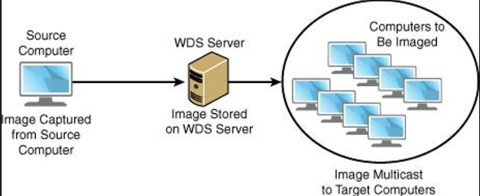
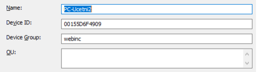

# Windows Deployment Service

WDS is a Microsoft server technology that enables the installation of Windows OS via a computer network. This technology can be used for the easy setup of new PCs. WDS is essentially a combination of existing technologies such as DHCP, TFTP, and PXE (Preboot Execution Environment).

## Installation

```
Install ADK and ADK WinPE (we have already worked with both in the first exercise).
```

```
Add the Windows Deployment Service role (Server Manager) = install both services (transport and deployment server)
```

```
Boot the target PCs from the network (pay attention to which interface receives info from DHCP!).
```
## WDS Configuration

Controlled through the Windows Deployment Services console.

```
First, we need to configure:
```

```
WDS > Servers > server.ecbwin.local > Configure Server (context menu)
```

### Key Points

**Domain Integration** — yes, for our purposes, we want to utilize this. It allows us to join the machine to the domain after installation, use domain accounts to access the installer, define prestaged devices, etc.

**Proxy DHCP** — both checkboxes checked.

**PXE Response Mode** — we can choose whether to only respond to pre-specified clients or to install anywhere.

In server settings (Properties):

**Boot** — desired behavior when booting the boot image from PXE.

After installing the role by default, we need to insert boot and install images and start the service:

The boot image (usually WinPE) allows performing service tasks — disk formatting, driver loading, network data loading, file copying, etc. In this case, we'll use the boot image from the Windows installer ISO file.

The install image is a disk image that we want to transfer to the target computer — usually, it's the complete OS, possibly supplemented with applications, drivers, etc. When transferring to other PCs, it's useful to have a generalized image (using the Sysprep tool).

Obtaining an install image is possible, for example, by capturing an image (again, reference to the first exercise).

> capture image:
> 

> sysprep + dism
> 

> sysprep debugging:
> 
> 
> https://theitbros.com/sysprep-was-not-able-to-validate-your-windows-installation/
> 

### **Installation on Specific Device**

Specific configuration for prestaged devices — we can specify whether the installation should run immediately, use an unattend file, specific boot image, etc.

```
Active Directory Prestaged Devices > Add Device… (context menu)
```

Identification occurs via GUID (usually in BIOS or for VirtualBox using the command `C:\Program Files\Oracle\VirtualBox\vboxmanage list vms`), or MAC address. For HyperV, the MAC address of the interface is the easiest option.

# Lite-touch Deployment vs. Zero-touch Deployment

Unlike Lite touch deployment, zero-touch system installation requires no intervention from the administrator. Complete installation of a new system or reinstalling an existing one can be done without additional configuration or attention from a qualified person. Lite touch deployment minimizes the steps an administrator needs to perform manually (e.g., predefining through configuration files). Zero and Lite touch deployment options provide:

1. Answer file - lite-touch deployment.
2. Task Sequence - a tool for complete lite and zero-touch system installation.
3. Complete ZTD can also be done through ***Microsoft Endpoint Management Configuration Manager*** (formerly System Center Configuration Manager).

I've already shown working with an answer file as part of the [**Windows Installation**](https://www.notion.so/Instalace-Windows-f720dd5281684410b8844886bd33390e?pvs=21). However, WDS partially simplifies working with an answer file.

MDT (see below) allows for complete zero-touch deployment provided we have access to a database that matches records in the DB with physical machine data (MAC addresses or machine GUIDs).

```
Import-Module 'C:\Program Files\Microsoft Deployment Toolkit\Bin\MicrosoftDeploymentToolkit.psd1'
```

## Answer File
### **Skipping the Installation Wizard**

```
Active Directory Prestaged Devices > machine > Properties >Client Unattend > Create New…
```

- credentials — domain login credentials
- specifying install image
- Install info — in our case, disk0 part 2!

### **Skipping the Post-Installation Wizard (OOBE)**

We create an unattend file that allows us to skip OOBE and create a local user and join the domain. You can use the ***Windows System Image Manager*** tool (obtained by installing Win ADK).

4specialize — Component Microsoft-Windows-Unattend-Join

- identification
- credentials

7oobeSystem — Component Microsoft-Windows-Shell-Setup

- OOBE
- User Accounts

## MDT (Microsoft Deployment Toolkit)


https://www.techthoughts.info/mdt-with-wds-integration-overview/

- A set of tools and components to facilitate pre and post-installation tasks when deploying Windows OS.
- A standalone installation package, cannot be installed through Server Administration.

Basic tasks that MDT helps to address:

- installation and configuration of basic settings after OS installation (activation, domain join, etc.), but also before OS installation (disk partitioning, storing previous network configuration, and its restoration).
- installation of applications and drivers after OS installation.
- user data migration (User State Migration).
- new tool ***Deployment Workbench.***
Working with MDT involves creating a custom boot image that boots the target machine into a special WinPE version that performs predefined tasks (defined within the Task Sequence).

### Steps to Work with Deployment Workbench

1. Create a new deployment share
- Deployment share is a shared directory containing all files necessary for system deployment.
- subsequent rule check and PXE adjustment (context menu > Properties)
- you need to regenerate images every time a rule or PXE setting is modified — changes are immediately incorporated into the boot image.

2. Import the operating system image

- context menu > Import New Image

3. Create a task sequence

- a list of tasks to be performed (or that can be performed) during installation.
- changes in TS do not require image regeneration.

4. Add the generated image from MDT to WDS.

### Lite and Zero-touch Deployment Configuration

Zero and Lite touch settings are defined through 2 files - ***customsettings.ini*** and ***bootstrap.ini***.

```
Deployment Workbench > Deployment share > Context menu > Properties > Rules
```

Some customsettings.ini settings are created when creating the deployment share. More information about bootstrap rules and settings can be found, for example, on https://www.techrepublic.com/article/mdt-automating-deployments-using-customsettings-ini/ or

1. **Launching the Windows Deployment Services Console:**
   - Start the Windows Deployment Services console.

2. **Configuring the WDS Server:**
   - Go to Tools -> Action -> Windows Deployment Services -> Servers -> Configure Server.
   - Select "Respond only to known client" and click "Next."

3. **Adding Windows 10 Installation Image:**
   - Mount the Windows 10 ISO as a virtual DVD in the server.
   - In the WDS Manager, right-click on "Install Images" and select "Add new install image."
   - Create a group named "webinc" and add the image from sources/install.wim.
   
4. **Adding Boot Image:**
   - In the WDS Manager, go to "Boot Images" and select "New boot image."
   - Add the boot image from sources/boot.wim.

5. **Configuring Server Properties:**
   - In the server properties, set "Always continue to PXE for known clients."

6. **Starting the Server:**
   - Start the WDS server.

7. **Configuring Virtual Machine (PCZk2) for Network Boot:**
   - In the virtual machine settings, add a new network adapter with internal connection.
   - Make sure to disable Secure Boot.
   - Start the virtual machine and boot from the network.

8. **Assigning Static MAC Address:**
   - Go to the settings of the newly added network adapter in the virtual machine.
   - Navigate to Advanced Features -> MAC Address and set it to STATIC.
   - Use the MAC address 00155D6F4909.

9. **Pre-staging the Device in Active Directory:**
   - Switch back to the server and go to Active Directory prestaged device.
   - Add a new device with the PC name and MAC address, and assign it to the "webinc" group.
   - Fill in other details and save.

10. **Restarting the WDS Server:**
    - For safety, restart the WDS server.

11. **Starting the Virtual Machine:**
    - Start the virtual machine.
