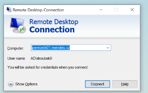

# Managing Remote Systems

## Computer Management

How to control via Computer Management and other tools. It's being blocked by FW. Therefore, it's necessary to allow on the firewall:

- %SystemRoot%\system32\vds.exe RPC and RPC EPMAP
- %SystemRoot%\system32\vdsldr.exe RPC
- System, TCP 445
- %SystemRoot%\system32\svchost.exe, RPC, RPC EPMAP
- %SystemRoot%\system32\services.exe, RPC, RPC EPMAP
- Note, this setting is universal (especially those working with SVCHOST.EXE), it would be good to create rules for individual services!

OR:

- Remote Event Log Management (all)
- Windows Management Instrumentation (DCOM-In)

## Remote Group Policy Enforcement

Group Policy Management — OU>KontextMenu>Group Policy Update…

- FW allow Remote Schedule Task Management (all)
- Windows Management Instrumentation (all)

## RDP — Remote Desktop Protocol - interactive sessions

A protocol that allows transferring screen and control and connecting users to a remote machine. Logging in as if sitting at the computer. A so-called **session** is created. The session type is then "local" and "remote".

- In Windows, there is typically a restriction to one active session. This can be changed by purchasing terminal services = multiple users at once.
- Enable in the system — can set users who should have access. (e.g., admin users on machine IT01)
    - Settings - System - Remote Desktop
    - System Settings, Remote Access tab
- Can also be done through GPO
1. **Computer Configuration/Administrative Templates/Windows Components/Remote Desktop Services/Remote Desktop Session Host/Connections/Allow users to connect remotely using Remote Desktop Services**
- Allow communication on the firewall: **Remote Desktop User Mode** — ( TCP in)
- %SystemRoot%\system32\svchost.exe, TCP 3389
- There are hacks to enable multiple user logins by modifying termsrv.dll.

### Remote Assistance — Quick Assist

Similar principle to Team Viewer.
Computers don't need to see each other on the network, a secure tunnel is created through Microsoft servers (direct visibility to MS servers via port 443 required). More at https://docs.microsoft.com/en-us/windows/client-management/quick-assist.
The person providing assistance must log in via an MS account or work account.
In earlier versions, there was an issue with UAC: the login option was not displayed on the assisting PC — potentially an issue with entering the administrator password. However, this can be addressed using policies (Security Settings > Local Policies > Security Options > User Account Control: Switch to the secure desktop when prompting for elevation — https://learn.microsoft.com/en-us/answers/questions/238459/uac-prompt-is-blocked-when-i-use-quick-assist.html)

### Server Management

Installation of Core server + management via Server Manager

- sconfig/Join to domain, Name Settings
- Server Manager/Manage/Add Server/find machine/>/OK

### PowerShell

- cmdlet invoke-command
- WinRM must be activated

```
winrm quickconfig
```

```
Invoke-Command -ComputerName it01 -ScriptBlock {hostname}
```

### Windows Remote Management

https://docs.microsoft.com/en-us/windows/win32/winrm/portal

# LAPS

- Local Administrator Password Solution — remote management of local administrator password settings
- https://www.microsoft.com/en-us/download/details.aspx?id=46899
- configured at OU level.

### Server

**Installation**

- management tools or everything

**Configuration**

- https://4sysops.com/archives/how-to-install-and-configure-microsoft-laps/
- Import-module AdmPwd.PS
- Update-AdmPwdADSchema (**schema extension**)
- Find-AdmPwdExtendedRights -Identity “IT”
- Set-AdmPwdReadPasswordPermission -Identity “IT” -AllowedPrincipals “pcadmins” (**definition of users/groups and OUs with permissions**)
- Set-AdmPwdComputerSelfPermission -Identity “IT” (**activation of password change option for given OU**)
- set GPO on specific OU— Computer Configuration > Policies > Administrative Templates > LAPS (**Password settings, Enable LAPS, Name of administrator…**)

### Client

**Installation**

- only GPO extension

**Configuration**

- not necessary on the client side

For the LAPS UI to run correctly, administrative permissions are required (and membership in the correct group).

# KMS server

https://docs.microsoft.com/en-us/windows-server/get-started/kms-client-activation-keys

KMS service is used for internal distribution of keys/activation of SW from MS.

### Server side

```
Install-WindowsFeature -Name VolumeActivation -IncludeManagementTools
```

```
Set-NetFirewallRule -Name SPPSVC-In-TCP -Profile Domain,Private -Enabled True
```

```
vmw.exe
```

To complete activation, a **KMS host key** is required. This key is unique to each organization and sharing it is not desirable — typically it can be obtained from the MS SW distributor.

Client side
```
slmgr /skms server.ecbwin.local

slmgr /ato
```
1. **Open Group Policy Management and navigate to the accounting department:**
   - Open Group Policy Management and switch to the accounting department.

2. **Create a new Group Policy Object (GPO) and add a group to restricted groups:**
   - Right-click on the accounting department in Group Policy Management and select "Create a GPO in this domain, and Link it here."
   - Name the GPO and confirm.
   - Right-click on the created GPO and choose "Edit."
   - In the Policy Editor, navigate to:
     - Computer Configuration -> Policies -> Windows Settings -> Security Settings -> Restricted Groups.
   - Right-click and select "Add Group":
     - Search for the group EndpointAdmins for both the group name and members.
     - Search for Administrators as the group.

3. **Edit the new group policy for the accounting department:**
   - Still in the Policy Editor, go to the created GPO for the accounting department.
   - To enable RDP connection:
     - Computer Configuration -> Policies -> Administrative Templates -> Windows Components -> Remote Desktop Services -> Remote Desktop Session Host -> Connections.
     - Set "Allow users to connect remotely" to "Enabled."
   - To add the accounting group to the Remote Desktop Users group:
     - Computer Configuration -> Policies -> Windows Settings -> Security Settings -> Restricted Groups.
     - Add the "ucetniRDP" group and include the "Remote Desktop Users" group.
   - To configure the Windows Firewall rule:
     - Computer Configuration -> Policies -> Windows Settings -> Security Settings -> Windows Firewall with Advanced Security -> Inbound Rules.
     - Create a new rule:
       - Rule type: Predefined.
       - Predefined rule type: Remote Desktop.
       - Action: Enable.

4. **Enforce the policy (optional):**
   - If necessary, set the policy as enforced to ensure it's applied even in conflicts with other policies.
   - You can find this option in the policy properties in the Policy Editor.