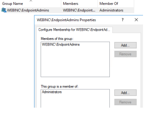

1. **Open Group Policy Management and navigate to the accounting department:**
   - Open Group Policy Management and switch to the accounting department.

2. **Create a new Group Policy Object (GPO) and add a group to restricted groups:**
   - Right-click on the accounting department in Group Policy Management and select "Create a GPO in this domain, and Link it here."
   - Name the GPO and confirm.
   - Right-click on the created GPO and choose "Edit."
   - In the Policy Editor, navigate to:
     - Computer Configuration -> Policies -> Windows Settings -> Security Settings -> Restricted Groups.
   - Right-click and select "Add Group":
     - Search for the group EndpointAdmins for both the group name and members.
     - Search for Administrators as the group.

3. **Edit the new group policy for the accounting department:**
   - Still in the Policy Editor, go to the created GPO for the accounting department.
   - To enable RDP connection:
     - Computer Configuration -> Policies -> Administrative Templates -> Windows Components -> Remote Desktop Services -> Remote Desktop Session Host -> Connections.
     - Set "Allow users to connect remotely" to "Enabled."
   - To add the accounting group to the Remote Desktop Users group:
     - Computer Configuration -> Policies -> Windows Settings -> Security Settings -> Restricted Groups.
     - Add the "ucetniRDP" group and include the "Remote Desktop Users" group.
   - To configure the Windows Firewall rule:
     - Computer Configuration -> Policies -> Windows Settings -> Security Settings -> Windows Firewall with Advanced Security -> Inbound Rules.
     - Create a new rule:
       - Rule type: Predefined.
       - Predefined rule type: Remote Desktop.
       - Action: Enable.

4. **Enforce the policy (optional):**
   - If necessary, set the policy as enforced to ensure it's applied even in conflicts with other policies.
   - You can find this option in the policy properties in the Policy Editor.

