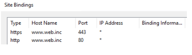

1. **Downloading a template from free-css.com and saving it to c:\inetpub\wwwroot:**
   - Visit free-css.com and download a template.
   - Unzip the downloaded file and save the folder to c:\inetpub\wwwroot.

2. **Opening the IIS Manager and creating a new website:**
   - Open "Administrative Tools" and launch "IIS Management Console."
   - Click on "Add website" and fill in:
     - Name: web.inc.
     - Path to the folder where you saved the template.
     - Hostname: www.web.inc (or www.webinc.local).
   - Click "Save."

3. **Creating a self-signed certificate for HTTPS:**
   - Click on the server in the IIS Management Console.
   - Click on "Server certificates" and create a self-signed certificate.

4. **Configuring HTTPS binding:**
   - For HTTP binding, it's not necessary if you correctly set the hostname in the previous step (www.webinc.local).
   - For HTTPS binding, assign the created certificate and use the same name as the hostname (www…).

5. **Configuring DNS for accessing the website:**
   - Open DNS tools and find the domain.
   - Right-click on the domain and select "New Host A AAAA."
   - Enter the name: www and the server's IP address.
   - If using CNAME, specify the path to the FQDN name of the server for the local network.

6. **Verifying the correctness of the settings:**
   - Try pinging the hostname www.web.inc.
   - Open a browser and check if the website www.web.inc (or www.webinc.local) is working.

7. **Resolving security errors (if any appear):**
   - Add the websites to the browser's security settings if security errors occur.

8. **Logging in to the web server:**
   - Log in using the format DOMAIN(WEBINC)\Administrator(user), if required.
